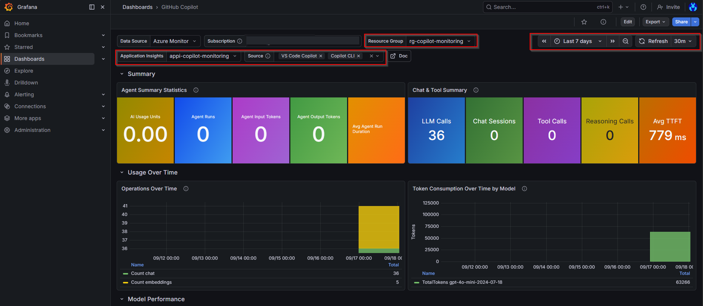
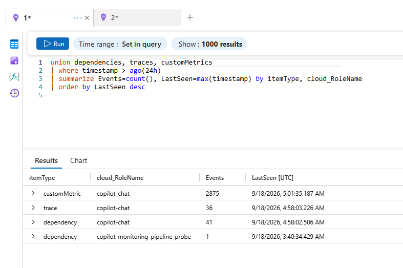
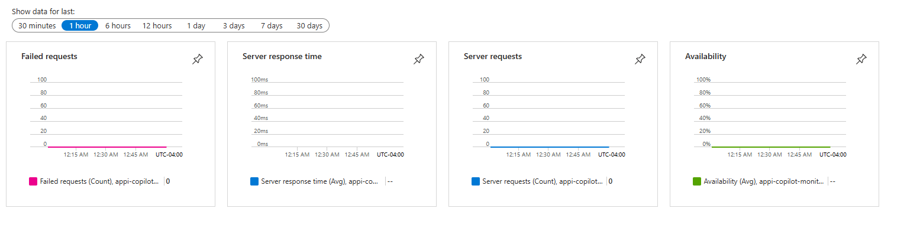

# Agent AI Dashboard

Deploy a reusable GitHub Copilot telemetry pipeline with Azure Application Insights, Log Analytics,
Azure Managed Grafana, and a local OpenTelemetry Collector.

[](https://portal.azure.com/#create/Microsoft.Template/uri/https%3A%2F%2Fraw.githubusercontent.com%2Fthiagogbeier%2Fagentaidashboard%2Fmain%2Finfra%2Fazuredeploy.json)
[](https://github.com/thiagogbeier/agentaidashboard/actions/workflows/validate.yml)

> **Cost notice:** Azure Managed Grafana Standard has a recurring charge. Log Analytics and
> Application Insights charge for ingestion and retention. Review current Azure pricing before
> deployment.

## What it deploys

```text
GitHub Copilot Chat / CLI
          |
          | OTLP localhost:4318 / 4317
          v
OpenTelemetry Collector Contrib
          |
          v
Application Insights -> Log Analytics -> Azure Managed Grafana
```

- One Azure resource group
- Log Analytics workspace
- Workspace-based Application Insights
- Azure Managed Grafana Standard
- GitHub Copilot Grafana dashboard, gallery ID `25053`
- Resource-group-scoped Monitoring Reader for the Grafana managed identity
- Grafana-resource-scoped Grafana Admin for the deploying user
- Pinned, checksum-verified Windows OpenTelemetry Collector
- VS Code and GitHub Copilot CLI telemetry settings
- Persistent Windows Scheduled Task for the Collector

## Recommended: guided PowerShell deployment

### 1. Install the prerequisites

You need:

- A 64-bit Windows 10 or Windows 11 computer
- [Git for Windows](https://git-scm.com/download/win)
- [PowerShell 7 or later](https://learn.microsoft.com/powershell/scripting/install/installing-powershell-on-windows)
- [Azure CLI](https://learn.microsoft.com/cli/azure/install-azure-cli-windows)
- An Azure subscription where your account can create resources and role assignments
- Internet access to GitHub, Azure, and `grafana.com`
- [Visual Studio Code](https://code.visualstudio.com/) with
  [GitHub Copilot Chat](https://marketplace.visualstudio.com/items?itemName=GitHub.copilot-chat),
  [GitHub Copilot CLI](https://docs.github.com/copilot/how-tos/set-up/install-copilot-cli), or both

For Azure permissions, the simplest option is **Owner** on the target subscription. Alternatively,
you need permissions to create the resources plus `Microsoft.Authorization/roleAssignments/write`
at the resource group and Managed Grafana scopes. Ask your Azure administrator if you are unsure.

You can install Git, PowerShell, and Azure CLI from Windows Terminal or Windows PowerShell with:

```powershell
winget install --id Git.Git --exact
winget install --id Microsoft.PowerShell --exact
winget install --id Microsoft.AzureCLI --exact
```

Close and reopen the terminal after installation. Then confirm that all three commands work:

```powershell
git --version
pwsh --version
az version
```

### 2. Sign in to Azure and select a subscription

Open **PowerShell 7** and run:

```powershell
az login
az account list --output table
az account set --subscription '<subscription-name-or-guid>'
az account show --output table
```

The last command must show the subscription where you want to create the dashboard resources. Use
an interactive user account rather than a service principal because the deployment grants that
signed-in user access to Grafana.

### 3. Download and run the deployment

```powershell
git clone https://github.com/thiagogbeier/agentaidashboard.git
cd agentaidashboard
pwsh -NoProfile -File .\scripts\Deploy.ps1
```

The script first performs read-only discovery, prints the complete deployment plan, and runs Azure
`what-if`. Review both the plan and the resource changes. If they are correct, type `YES` and press
Enter; capitalization does not matter. For an existing Azure deployment, the script saves the
discovered state in this repository and runs `Status.ps1` before asking for confirmation. Any other
response cancels without making Azure deployment or runtime configuration changes.

The deployment can take several minutes. Keep the PowerShell window open until it displays
`Deployment completed successfully` and prints the **Grafana**, **Dashboard**, and **Status** paths.
The script also:

- creates or updates the Azure resources;
- installs the Azure Managed Grafana CLI extension;
- imports and configures dashboard `25053`;
- downloads and verifies the OpenTelemetry Collector;
- updates the current user's VS Code settings, backing up an existing `settings.json`;
- sets user-level environment variables for GitHub Copilot CLI; and
- starts the Collector as the `AgentAIDashboard-OtelCollector` Scheduled Task.

> **No manual Grafana import is required.** `Deploy.ps1` checks for dashboard UID
> `GitHubCopilot`, imports gallery dashboard `25053` when it is missing, and sets the Azure Monitor
> data source, subscription, resource group, and Application Insights defaults. Only troubleshoot
> the import if the script reports an error or the status page says the dashboard is missing.
>
> **Existing deployments are reused.** Before showing the deployment plan, the script checks the
> target resource group. If it exists, it must contain exactly one Managed Grafana resource, one
> Application Insights resource, and one Log Analytics workspace. The script reuses their actual
> names. It stops before `what-if` if a resource is missing, multiple resources of the same type
> exist, or an explicitly supplied name does not match.
>
> **The Collector is not committed to Git.** On a new workstation, it is downloaded into
> `otelcol\` only after the user approves the `what-if` plan. The generated
> `otel-collector-config.yaml` is also local and ignored because it contains the Application
> Insights ingestion connection string. If ports 4317 and 4318 are already served by a compatible
> Collector targeting the same Application Insights resource, the script verifies and reuses that
> runtime regardless of its installation folder.

Common overrides for a new deployment:

```powershell
.\scripts\Deploy.ps1 `
  -SubscriptionId '<subscription-guid>' `
  -Location 'eastus' `
  -ResourceGroupName 'rg-my-copilot-monitoring' `
  -GrafanaName 'amg-my-unique-name' `
  -CaptureContent $false
```

`CaptureContent` defaults to `false`. Enabling it may export prompt/response content; review your
organization's data-handling requirements first.

### 4. Restart Copilot and generate the first telemetry

After deployment:

1. Close **all** VS Code windows, then reopen VS Code. A full restart is required for Copilot Chat to
   load the new telemetry settings.
2. If you use GitHub Copilot CLI, close the old terminal and open a new one so it receives the new
   environment variables. Running Copilot CLI from a terminal that was already open before setup
   produces no `github-copilot` telemetry, so the Grafana **Copilot CLI** filter will be empty.
3. Make sure VS Code is signed in to GitHub and Copilot Chat is working.
4. Send a new prompt in Copilot Chat, or start GitHub Copilot CLI and submit a prompt.
5. Wait a few minutes for the Collector, Application Insights, and Grafana to ingest the first
   events.

Prompt and response text is not collected unless you explicitly deploy with `-CaptureContent $true`.
Operational telemetry such as traces, requests, dependencies, and metrics is still collected.

### 5. Verify the installation

From the cloned repository, run:

```powershell
.\scripts\Status.ps1 -Open
```

The generated `reports\status.html` checks the active Azure subscription, Azure resources, Grafana
dashboard, recent telemetry, Scheduled Task, local Collector files, OTLP listener ports, VS Code
settings, and Copilot CLI environment variables.

Open the **Dashboard** URL printed by `Deploy.ps1`. Sign in with the same Azure account if prompted.
If the dashboard initially shows **No data**, wait a few more minutes, generate another Copilot
prompt, and run the status command again. See
[Troubleshooting](docs/TROUBLESHOOTING.md) if any status item still fails.

The imported **GitHub Copilot** dashboard should look similar to this after telemetry arrives. Confirm
that **Data Source**, **Subscription**, **Resource Group**, and **Application Insights** contain the
values selected during deployment:



## Azure Portal deployment

The **Deploy to Azure** button is an alternative way to create the Azure resources. It does **not**
configure VS Code, GitHub Copilot CLI, the local Collector, or the Grafana dashboard by itself.

1. Select **Deploy to Azure** at the top of this README.
2. Sign in to Azure if prompted and select the intended subscription.
3. Leave the fields at their defaults for the simplest setup, or change **Resource Location** to your
   preferred Azure region.
4. Select **Review + create**, wait for validation to pass, then select **Create**.
5. Wait until Azure reports that the deployment completed successfully.
6. Complete the workstation setup by following steps 1 and 2 above, cloning this repository, and
   running `Deploy.ps1` as shown below.

Leave **Grafana Name** as `auto` to generate a deterministic, subscription-unique name. Leave
**Grafana Admin Principal Id** as `current-deployer` to grant access to the identity launching the
deployment. You can override either value; clear the principal ID only if you intentionally want to
skip the Grafana Admin assignment.

Azure Portal's **Region** stores the subscription-level deployment record. **Resource Location**
controls where the monitoring resources are created; the two values may differ.


Leaving every field at its default, as shown above, is the recommended path:

- **Region** (`(US) North Central US`) only stores the subscription-level deployment record and does
  not affect where resources are created — ignore it.
- **Resource Location** (`canadacentral`) is what actually matters: the resource group, Log Analytics
  workspace, Application Insights, and Grafana are all created there.
- **Resource Group Name**, **Log Analytics Workspace Name**, and **Application Insights Name** keep
  their shown defaults (`rg-copilot-monitoring`, `law-copilot-monitoring`, `appi-copilot-monitoring`).
- **Grafana Name** = `auto` generates the deterministic name `amg-cop-<uniqueString(subscriptionId)>`.
- **Grafana Admin Principal Id** = `current-deployer` grants Grafana Admin to whichever identity is
  signed in to the Portal when you click **Review + create**.

These are exactly `Deploy.ps1`'s own parameter defaults, so with this form unchanged you can complete
the local setup with the subscription ID and no name overrides:

```powershell
git clone https://github.com/thiagogbeier/agentaidashboard.git
cd agentaidashboard
az login
az account set --subscription '<subscription-guid>'
pwsh -NoProfile -File .\scripts\Deploy.ps1 -SubscriptionId '<subscription-guid>'
```

After a Portal deployment, clone the repository and run `scripts/Deploy.ps1` with the same names.
The script is idempotent and completes the local Collector, dashboard import/defaults, user-scoped
settings, and status checks. If the resource group contains one Managed Grafana resource and you
omit `-GrafanaName`, the script automatically reuses that resource. It does not create another one.

If you changed any field away from its default in the Portal, pass matching overrides to
`Deploy.ps1` instead of the single-parameter command above — match each parameter to the value you
typed:

```powershell
pwsh -NoProfile -File .\scripts\Deploy.ps1 `
  -SubscriptionId '<subscription-guid>' `
  -Location 'eastus' `
  -ResourceGroupName '<value typed for Resource Group Name>' `
  -LogAnalyticsWorkspaceName '<value typed for Log Analytics Workspace Name>' `
  -ApplicationInsightsName '<value typed for Application Insights Name>' `
  -GrafanaName '<value typed for Grafana Name, omit if left as auto>'
```

`Deploy.ps1` has no parameter for **Grafana Admin Principal Id**; it always grants Grafana Admin to the
currently signed-in `az` identity, matching the Portal's `current-deployer` default.

The repository is public, so Azure Portal can download the ARM template directly from the button.
The Portal may summarize the template as **2 resources** because it counts the resource group and
its nested deployment at subscription scope; the nested deployment contains the monitoring
resources and role assignments listed above.

## Ongoing verification

If you already followed the guided PowerShell deployment, this repeats the verification command for
future checks:

```powershell
.\scripts\Status.ps1 -Open
```

The generated `reports\status.html` checks Azure resources, the Grafana dashboard, recent telemetry, the
Scheduled Task, OTLP listener ports, and Copilot CLI settings.

For direct Azure verification, open the deployed Application Insights resource in Azure Portal,
select **Monitoring** > **Logs**, paste the following query, and select **Run**:

```kusto
union dependencies, traces, customMetrics
| where timestamp > ago(24h)
| summarize Events=count(), LastSeen=max(timestamp) by itemType, cloud_RoleName
| order by LastSeen desc
```

After Copilot telemetry arrives, the results include rows with the `copilot-chat` or
`github-copilot` cloud role:



The Application Insights **Overview** page confirms that the resource is available. Its standard
request charts may remain empty because Copilot telemetry is primarily inspected through Logs and
the imported Grafana dashboard:



For additional direct Azure verification queries, see the [KQL query runbook](docs/KQL.md).

## Remove the deployment and stop Azure charges

Deleting the local repository does not delete the billable Azure resources. When you no longer need
the dashboard, delete its resource group:

```powershell
az group delete --name 'rg-copilot-monitoring' --yes --no-wait
```

Replace `rg-copilot-monitoring` if you selected a different resource group name. Then remove the
local Scheduled Task and generated Collector files from the cloned repository:

```powershell
Unregister-ScheduledTask -TaskName 'AgentAIDashboard-OtelCollector' -Confirm:$false
Remove-Item .\otelcol -Recurse -Force
Remove-Item .\otel-collector-config.yaml, .\reports, .\.state -Recurse -Force -ErrorAction SilentlyContinue
```

The script creates a backup of existing VS Code settings at
`%APPDATA%\Code\User\settings.json.agent-ai-dashboard.bak`. Restore that backup or manually remove
`github.copilot.chat.otel.enabled`, `github.copilot.chat.otel.exporterType`,
`github.copilot.chat.otel.otlpEndpoint`, and `github.copilot.chat.otel.captureContent` from
**Preferences: Open User Settings (JSON)** if you no longer want VS Code to export telemetry.

Remove the Copilot CLI telemetry environment variables with:

```powershell
[Environment]::SetEnvironmentVariable('COPILOT_OTEL_ENABLED', $null, 'User')
[Environment]::SetEnvironmentVariable('COPILOT_OTEL_EXPORTER_TYPE', $null, 'User')
[Environment]::SetEnvironmentVariable('OTEL_EXPORTER_OTLP_ENDPOINT', $null, 'User')
```

Close and reopen VS Code and any terminal windows afterward. See
[Deployment details](docs/DEPLOYMENT.md) for more information.

## Repository layout

```text
.
|-- LICENSE
|-- README.md
|-- config/
|   |-- otel-collector-config.template.yaml
|   `-- vscode-settings.example.jsonc
|-- docs/
|   |-- ARCHITECTURE.md
|   |-- CODE_OF_CONDUCT.md
|   |-- CONTRIBUTING.md
|   |-- DEPLOYMENT.md
|   |-- KQL.md
|   |-- SECURITY.md
|   `-- TROUBLESHOOTING.md
|-- infra/
|   |-- azuredeploy.json
|   |-- main.bicep
|   `-- resources.bicep
|-- otelcol/
|   `-- README.md
|-- reports/
|   `-- README.md
|-- scripts/
|   |-- Deploy.ps1
|   `-- Status.ps1
`-- .github/workflows/validate.yml
```

## Security and privacy

- No tenant IDs, subscription IDs, connection strings, access tokens, or downloaded binaries are
  committed.
- Runtime configuration is generated locally into ignored files.
- Grafana uses managed identity rather than a client secret.
- See [docs/SECURITY.md](docs/SECURITY.md).

## Documentation

- [Architecture](docs/ARCHITECTURE.md)
- [Deployment details](docs/DEPLOYMENT.md)
- [KQL query runbook](docs/KQL.md)
- [Troubleshooting](docs/TROUBLESHOOTING.md)
- [Contributing](docs/CONTRIBUTING.md)
- [License](LICENSE)

## Credits

- [Wuyi Weng](https://www.linkedin.com/in/wuyi-weng-a8366369/)
- [Anthony Bartolo](https://www.linkedin.com/in/wirelesslife/)

## References

- [Dashboards are for AI agents too, not just humans](https://techcommunity.microsoft.com/blog/appsonazureblog/dashboards-are-for-ai-agents-too-not-just-humans/4556383)
- [Deploy to Azure button](https://learn.microsoft.com/en-us/azure/azure-resource-manager/templates/deploy-to-azure-button)
